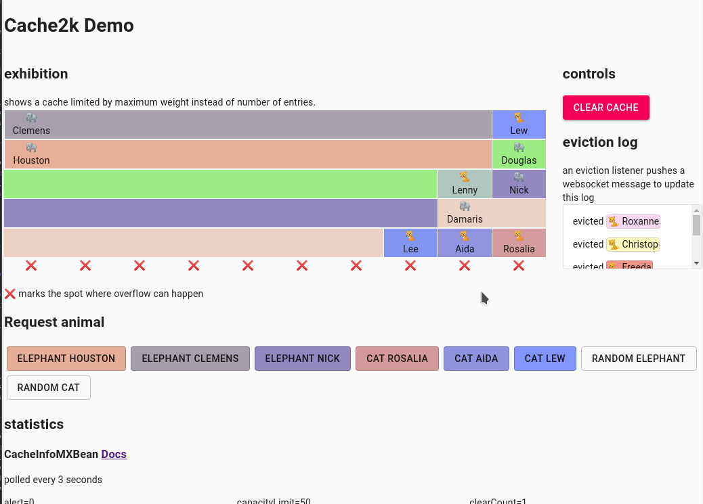

 
 # Weigher 
 You can choose to limit cache capacity by weight instead of number of entries (cache2k version >[1.4.0](https://github.com/cache2k/cache2k/releases/tag/v1.4.0.Final)). This allows for example limiting by (estimated) memory consumption. 
 
 This demo also shows cache2ks event listeners and statistics. 
 
 
 Use `mvn spring-boot:run` to start the application, then go to http://localhost:8080
 
 Or check out the [Public Demo](https://weigher.azurewebsites.net/)
 

 
 
 
